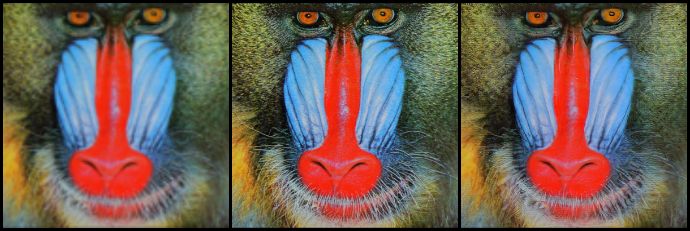
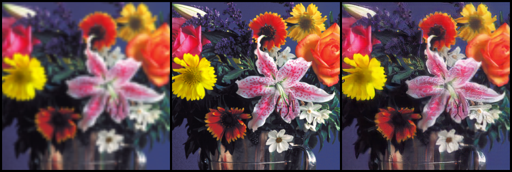
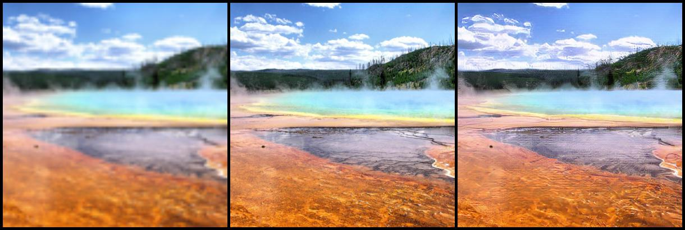
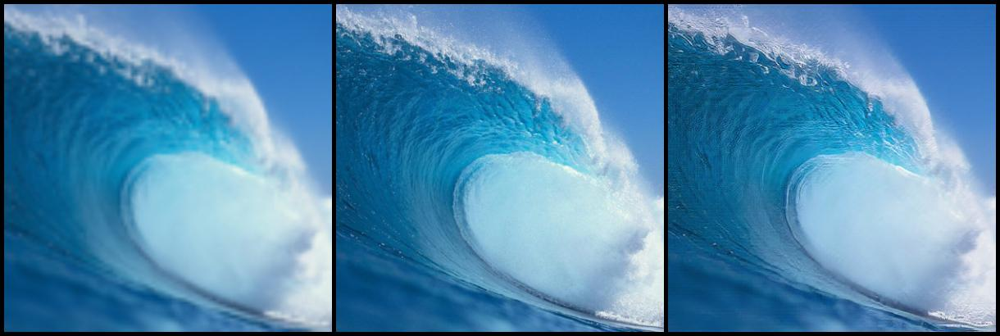

# SRGAN

PyTorch implementacija SRGAN mreže po uzoru na 
[Photo-Realistic Single Image Super-Resolution Using a Generative Adversarial Network](https://arxiv.org/abs/1609.04802) rad.

## Skupovi podataka

Trening podaci:
- [VOC2012]()

Test podaci:
- [Set5]()
- [Set14]()
- [BSD100]()
- [SunHays80]()

## Modeli

U repozitoriju možemo naći dva modela. 

Prvi model nazivamo SRGAN model i predstavlja implementaciju modela opisanog
u "[Photo-Realistic Single Image Super-Resolution Using a Generative Adversarial Network](https://arxiv.org/abs/1609.04802)" radu. 

Kako je rad odgovoran za stabilnije treniranje generativnih suparničkih mreža
([Improved Training of Wasserstein GANs](https://arxiv.org/abs/1704.00028)) objavljen nakon SRGAN rada, 
implementiran je i drugi model po uzoru na SRGAN rad sa WGAN-GP cost funkcijom.

## Instrukcije

- Skinite gore navedene podatke i postavite ih u odgovarajuće foldere (folderi "train_data" i "test_data" sadrže instrukcije o postavljanju podataka).
- Pokretanjem "srgan_train.py" koda treniramo prvi (SRGAN) model.
- Pokretanjem "wgan_train.py" koda treniramo drugi (SRWGAN-GP) model. 
- Postavljanjem ispravnog puta do ".pth" datoteke u "model_tester.py" i pokretanjem koda dobivamo rezultate našeg modela u "test_results" folderu.
- Postavljanjem ispravnog puta do ".pth" i slikovne datoteke u "image_enhancer.py" i pokretanjem koda dobivamo sliku (4x) povećane rezolucije u "test_results" folderu.

## Rezultati

U tablici vidimo usporedbu modela iz SRGAN rada sa našim modelom (vrijednost u zagradama).

| Dataset | Scale |       PSNR       |        SSIM        |     MOS     |
| :-----: | :---: | :--------------: | :----------------: | :---------: |
|  Set5   |   4   | 29.40 (**-**) | 0.8472 (**-**) | 3.58 (**-**) |
|  Set14  |   4   | 26.02 (**-**) | 0.7397 (**-**) | 3.72 (**-**) |
| BSDS100 |   4   | 25.16 (**-**) | 0.6688 (**-**) | 3.56 (**-**) |

Slijedi nekoliko primjera slika gdje prva slika predstavlja sliku niske rezolucije, druga slika sliku visoke rezolucije, 
a treća slika sliku generiranu našim modelom (sliku 4x povećane rezolucije).

Baboon:

Flowers:

Hot spring:

Wave:

